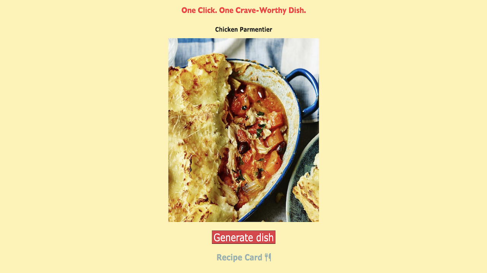

# 🍽️ Taste-Twists

**Taste-Twist** is a delightful web application that fetches a random dish from a free API, displaying the dish's image and providing a link to its recipe card. It's perfect for food enthusiasts looking to explore new recipes effortlessly.

---

## 🧠 About The Project

Taste-Twists aims to inspire culinary exploration by suggesting random dishes to users. With a simple click, users receive a new dish recommendation, complete with an image and a direct link to the recipe.

### 🛠️ Built With

- **HTML** – Structure of the page  
- **CSS** – Styling and layout  
- **JavaScript** – API integration and dynamic rendering  

---

## 📸 Screenshot

---

## 📄 License

Distributed under the MIT License. See `LICENSE` for more information.

---

## 📬 Contact

**Azeez Olaosebikan**  
[GitHub](https://github.com/ozazeez)  
[LinkedIn](https://www.linkedin.com/in/azeezolaosebikan)
